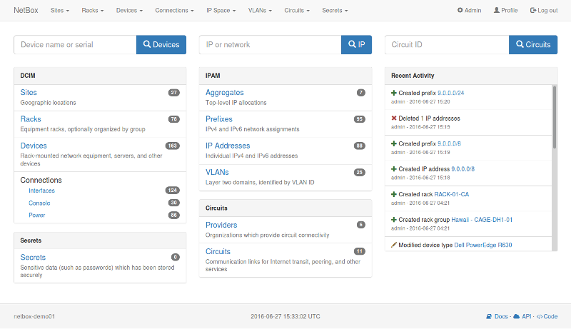
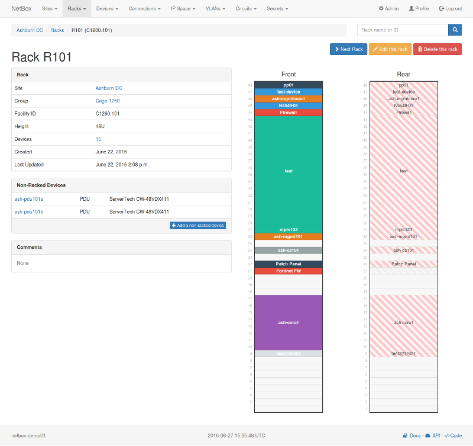
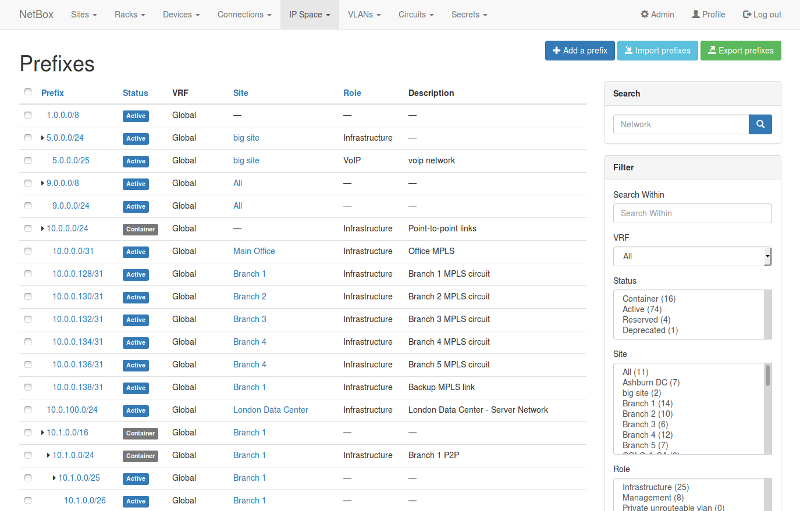

 Зы логотип покак не придумал 

NetBox-NG это форк проэкта Netbox.  это инструмент управления IP-адресами (IPAM) и центра обработки данных (DCIM). NetBox, первоначально разработанный группой сетевого проектирования [DigitalOcean](https://www.digitalocean.com/), был разработан специально для удовлетворения потребностей инженеров сети и инфраструктуры.

NetBox-NG работает как веб-приложение поверх [Django](https://www.djangoproject.com/) Python framework c  базой данныx[PostgreSQL](http://www.postgresql.org/) . Полный список требований см. В разделе `requirements.txt`. Код оригенального проэкта Netbox доступен [on GitHub](https://github.com/digitalocean/netbox).

Полную документацию для NetBox можно найти по адресу [Read the Docs](http://netbox.readthedocs.io/en/stable/).

NetBox-NG работает на версиях Python 2.7 and 3.5.  Python 3.5 рекомендуется.

## Скриншоты

## TODO

*  Смена UI Bootstrap на Cisco UIKit
*  Замена Django на Flask
*  Добавление функционала мониторинга

## Альтернативные установки

* [Docker container](https://github.com/ninech/netbox-docker) (via [@cimnine](https://github.com/cimnine))
* [Vagrant deployment](https://github.com/ryanmerolle/netbox-vagrant) (via [@ryanmerolle](https://github.com/ryanmerolle))
* [Original code] (https://github.com/digitalocean/netbox) (via [@digitalocean](https://github.com/digitalocean))
